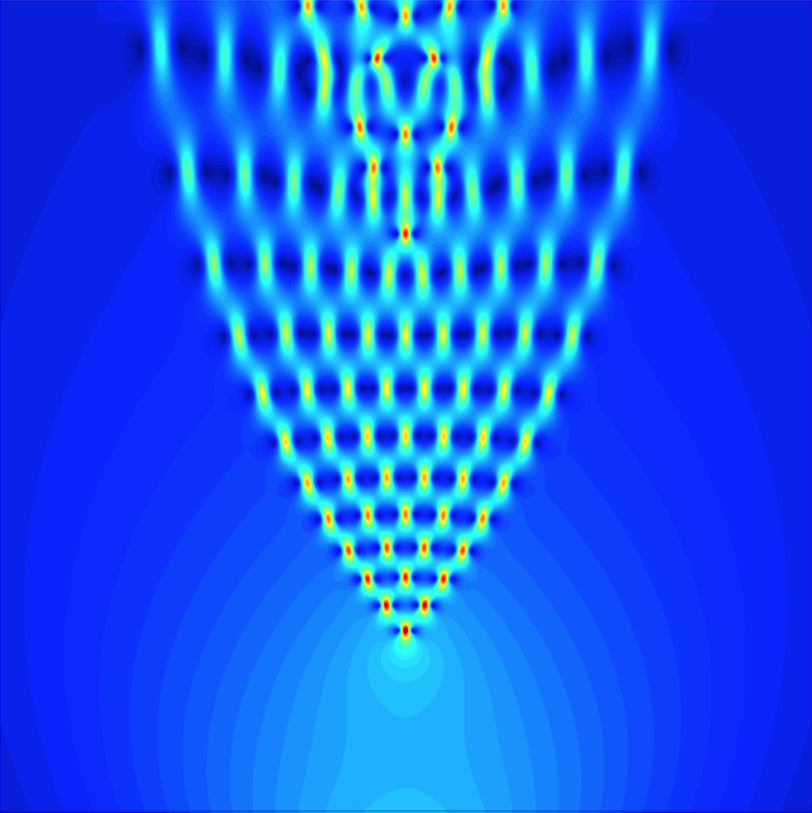

<!-- Navigation -->
<nav style="text-align: center; margin-bottom: 40px;">
  <a href="#cv" style="margin: 0 15px;">CV</a>
  <a href="#publications" style="margin: 0 15px;">Publications</a>
  <a href="#teaching" style="margin: 0 15px;">Teaching</a>
  <a href="#contact" style="margin: 0 15px;">Contact</a>
</nav>

<!-- Welcome Section -->

  

    <h1>Welcome!</h1>
    

      Welcome to my personal website.
      I am Benjamin Plumridge, a recent graduate of the University of Tennessee, Knoxville.  
      My research is focused on numerical analysis of partial differential equations, machine learning, and scientific computing.
    

  

  

<!-- CV Section -->

  <h2>Curriculum Vitae</h2>
  
<a href="CV.pdf" target="_blank">Download my CV</a>

<!-- Publications Section -->

  <h2>Publications</h2>
  

    <strong>Data-Driven Filtering of the Spherical Harmonics Method</strong> 
    Submitted to the <em>Journal of Scientific Computing</em> in October 2025. 
    <a href="https://www.arxiv.org/abs/2510.05452" target="_blank">arXiv:2510.05452</a>
  

  

    Filtered Variable Eddington Factor Method for Thermal Radiative Transfer (Manuscript in preparation)
  

<!-- Teaching Section -->

  <h2>Teaching</h2>
  
Details about courses taught, mentoring, or TA experience.

<!-- Contact Section -->

  <h2>Contact</h2>
  
You can reach me at <a href="mailto:bplumrid@vols.utk.edu">bplumrid@vols.utk.edu</a>

